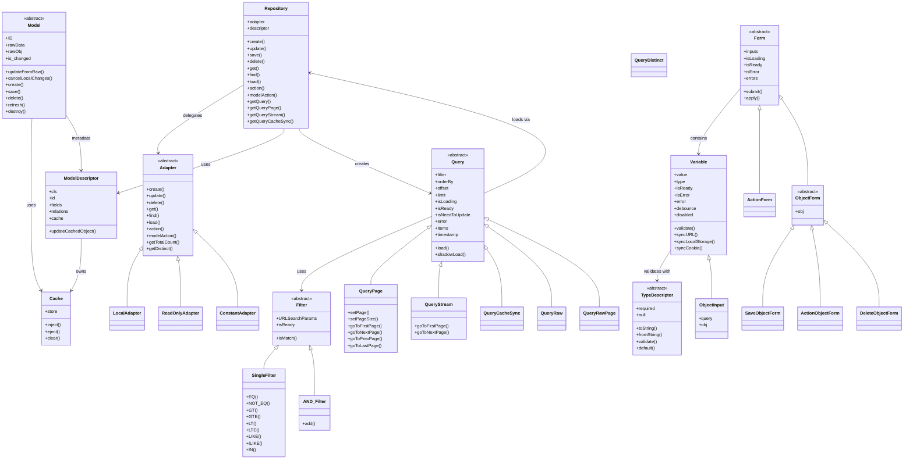

MobX-Model-UI
===
Library for data models and UI interactions built on MobX.
successor of [@Andrey-Omelyanuk/MobX-ORM:2.1.7](https://github.com/Andrey-Omelyanuk/mobx-orm)

Data and UI models based on [MobX](https://github.com/mobxjs/mobx)
Inspired by [ember-data](https://github.com/emberjs/data) and [js-data](https://github.com/js-data/js-data).
This library is another opinion (my personal) about what models should be on the front-end and how to work with them.

Introduction:
---
The library contains these entities:

    Model, Field, Repository, Adapter
    Query, Filter
    Input, Form

A quick example:
---

```ts
    // This example is not tested yet, it shows how I want it to work.
    import { Model, model, id, field, foreign, many } from 'mobx-model-ui'

    @model class User extends Model {
        @id    id   : number  // it can be a string for UUID for example
        @field name : string

        authorship: Author[]
    }

    @model class Book extends Model {
        @id    id   : number
        @field title: string

        authorship: Author[]
    }

    @model class Author extends Model {
        @id    id       : number 
        @field user_id  : string
        @field book_id  : string

        @foreign(User)  user: User 
        @foreign(Book)  book: Book 
    }
    many(Author)(User, 'authorship') 
    many(Author)(Book, 'authorship') 

    let user_a = new User({id: 1, name: 'User A'})
    let user_b = new User({id: 2, name: 'User B'})

    let book_a = new Book({id: 1, title: 'Book A'})
    let book_b = new Book({id: 2, title: 'Book B'})
    let book_c = new Book({id: 3, title: 'Book C'})

    new Author({id: 1, user_id: 1, book_id: 1})
    new Author({id: 2, user_id: 1, book_id: 2})
    new Author({id: 3, user_id: 1, book_id: 3})
    new Author({id: 4, user_id: 2, book_id: 3})

    for (const authorship of user_a.authorship) console.log(authorship.book.title)
    // Book A
    // Book B
    // Book C
    for (const authorship of user_b.authorship) console.log(authorship.book.title)
    // Book C
    for (const authorship of book_a.authorship) console.log(authorship.user.name)
    // User A
    for (const authorship of book_b.authorship) console.log(authorship.user.name)
    // User A
    for (const authorship of book_c.authorship) console.log(authorship.user.name)
    // User A
    // User B
```

More examples you can find in the ./e2e tests.


Architecture:
---

### Main Entities

```
┌─────────────────────────────────────────────────────────────────────┐
│                        DEFINITION LAYER                             │
│                                                                     │
│  @model ──► ModelDescriptor ──► models (global registry)            │
│  @id    ──► registers model, injects/ejects from Cache              │
│  @field ──► observable field with type validation                   │
│  @foreign──► many-to-one relation (auto-resolves from Cache)        │
│  one()  ──► one-to-one reverse relation                             │
│  many() ──► one-to-many reverse relation                            │
└──────────────────────────────┬──────────────────────────────────────┘
                               │
┌──────────────────────────────▼──────────────────────────────────────┐
│                        DATA LAYER                                   │
│                                                                     │
│  Model (abstract) ──────── Cache<ID, Model>                         │
│  ├ rawData / rawObj       ├ inject() / eject() / clear()            │
│  ├ is_changed             └ Identity Map: one instance per ID       │
│  ├ updateFromRaw()                                                  │
│  └ cancelLocalChanges()                                             │
│                                                                     │
│  Repository<M> ────────── Adapter<M> (abstract)                     │
│  ├ create()                ├ create() / update() / delete()         │
│  ├ update() / save()       ├ get() / find() / load()                │
│  ├ delete() / get()        ├ action() / modelAction()               │
│  ├ find() / load()         ├ getTotalCount() / getDistinct()        │
│  ├ action() / modelAction() └───────────────────────────────────────┘
│  └ getQuery / getQueryPage / getQueryStream / getQueryCacheSync     │
│                                    │
│                          ┌─────────┼──────────────┐
│                          ▼         ▼              ▼
│                    LocalAdapter  ReadOnlyAdapter  ConstantAdapter
│                    (in-memory)   (no writes)      (static data)
└──────────────────────────────┬──────────────────────────────────────┘
                               │
┌──────────────────────────────▼──────────────────────────────────────┐
│                        QUERY & FILTER LAYER                         │
│                                                                     │
│  Query<M> (abstract) ────── Filter (abstract)                       │
│  ├ filter / orderBy        ├ URLSearchParams (for API)              │
│  ├ offset / limit          ├ isMatch(obj) (client-side)             │
│  ├ isLoading / isReady     └────────────────────────────────────────┘
│  ├ autoupdate (reaction)                                           │
│  └ items / timestamp                                               │
│       │
│       ├─ QueryPage<M>     (pagination: setPage, goToNextPage...)    │
│       ├─ QueryStream<M>   (infinite scroll: append items)           │
│       ├─ QueryCacheSync<M> (live cache observation, no refetch)     │
│       ├─ QueryRaw<M>      (raw objects, no Model conversion)        │
│       ├─ QueryRawPage<M>  (raw + pagination)                        │
│       └─ QueryDistinct    (distinct field values)                   │
│                                                                     │
│  SingleFilter ── EQ, NOT_EQ, GT, LT, LIKE, ILIKE, IN ...           │
│  AND_Filter   ── combines multiple filters                          │
└──────────────────────────────┬──────────────────────────────────────┘
                               │
┌──────────────────────────────▼──────────────────────────────────────┐
│                        INPUT & FORM LAYER                           │
│                                                                     │
│  Variable<T>               ObjectInput<M>                           │
│  ├ value (observable)      ├ extends Variable<ID>                   │
│  ├ validation (TypeDesc)   ├ holds Query<M> for options             │
│  ├ debounce                └ obj getter (resolves from Cache)       │
│  ├ disable / error                                                  │
│  ├ sync: URL / localStorage / cookie                                │
│  └ isReady                                                          │
│                                                                     │
│  Form (abstract)           TypeDescriptor<T> (abstract)             │
│  ├ inputs: Map<Variable>   ├ toString() / fromString()              │
│  ├ isLoading / isError     ├ validate() / default()                 │
│  ├ isReady                 └ required / null                        │
│  ├ submit() → apply()                                          │
│  └ onSuccess / onCancel                                        │
│       │
│       ├─ ActionForm<M>        (repository.modelAction)              │
│       ├─ ObjectForm<M>        (bound to specific model instance)    │
│       │   ├─ SaveObjectForm<M>    (create/update model)             │
│       │   ├─ ActionObjectForm<M>  (run action on model)             │
│       │   └─ DeleteObjectForm<M>  (delete model)                    │
│                                                                     │
│  StringDescriptor / NumberDescriptor / BooleanDescriptor            │
│  DateDescriptor / DateTimeDescriptor / ArrayDescriptor              │
│  OrderByDescriptor ([field, ASC|DESC])                              │
└─────────────────────────────────────────────────────────────────────┘
```

### Class Relationships (Mermaid)



### Data Flow

```
  ┌──────────┐    ┌────────────┐    ┌──────────┐    ┌──────────┐
  │  Filter  │───►│   Query    │───►│Repository│───►│ Adapter  │
  └──────────┘    └────────────┘    └────┬─────┘    └────┬─────┘
                                         │               │
                                         ▼               │
  ┌──────────┐    ┌──────────┐    ┌──────────────┐       │
  │   Cache  │◄───│ModelDesc.│◄───│updateCached  │◄──────┘
  │          │    │          │    │Object(raw)   │
  └────┬─────┘    └──────────┘    └──────────────┘
       │
       │ @foreign / one() / many() observe Cache
       │ QueryCacheSync observes Cache
       ▼
  ┌──────────┐
  │    UI    │  (MobX reactions auto-update)
  └──────────┘
```

# For Developers:
I recommend using Docker for development. See the `makefile` for how to use it.

If you don't want to use Docker then you can see `scripts` commands in `package.json`
How to debug:
```sh
node_modules/.bin/jest --testMatch='**/src/**/*.spec.ts' --watchAll
node --inspect-brk=0.0.0.0 node_modules/.bin/jest --runInBand --testMatch='**/src/**/model-class.spec.ts'
node --inspect-brk=0.0.0.0 node_modules/.bin/jest --runInBand -t 'raw_obj with one relations'
chrome://inspect/#devices
```
